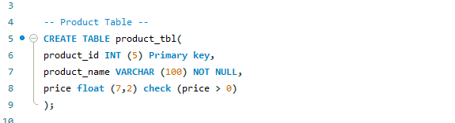
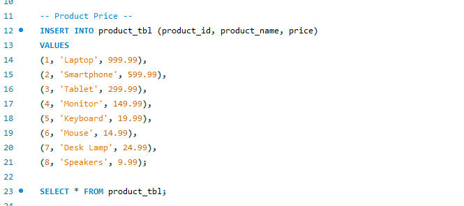
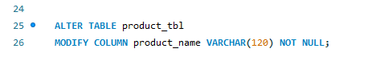
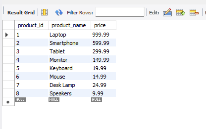

# Final task 3
This portfolio shows how to learn MySQL by building and maintaining a product database. To properly arrange a database using simple SQL, the procedure include building a table, applying constraints, introducing legitimate goods, and changing table columns

### Step 1:
Create a table named products
Add three fields:
id, auto-increment and primary key
product_name,text up to 100 characters, cannot be empty
price, decimal

### Step 2: Add a Rule
Add a CHECK constraint to ensure price is greater than 0.

### Step 3: Insert Valid Products
Insert products with positive prices:
Laptop – 999.99
Smartphone – 599.99
Tablet – 299.99
Keyboard – 19.99
Mouse – 14.99
Desk Lamp – 24.99
Speakers – 9.99
Skip products with negative prices.

### Step 4: Update the Table
Change the product_name field to allow up to 120 characters.

## Screenshots
### Product Query Statement

### Product Price Query Statement

### Modify Query Statement

## Product Price Table

